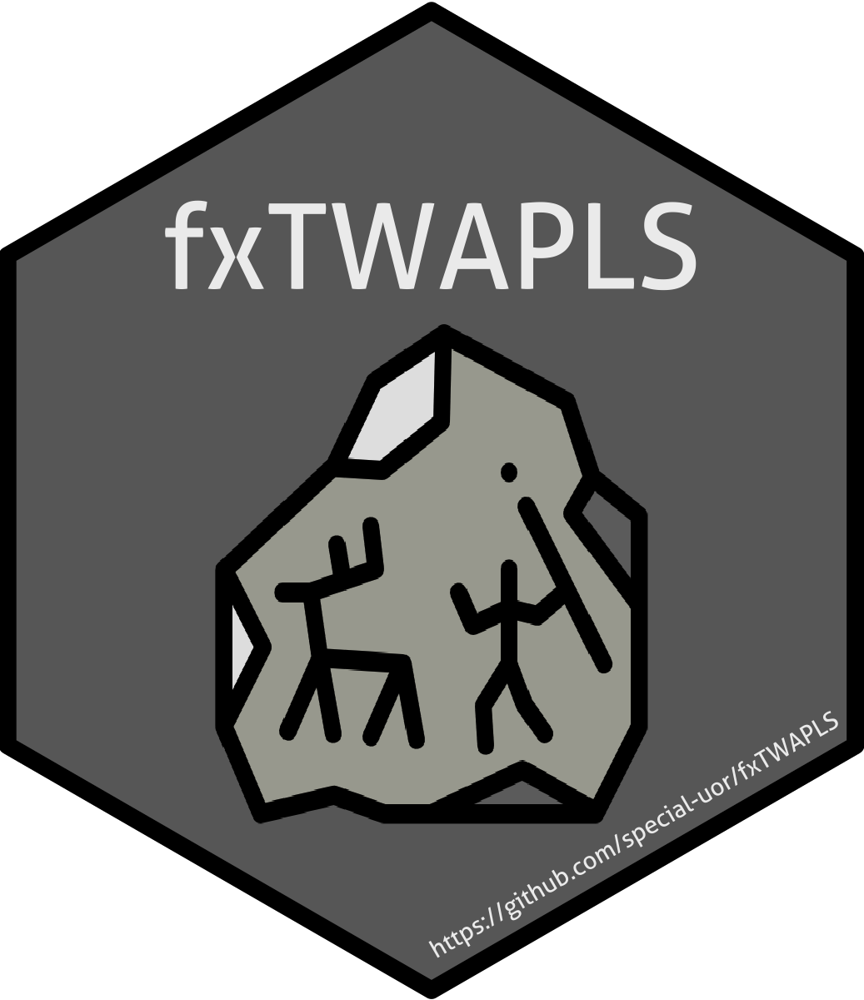

<!-- README.md is generated from README.Rmd. Please edit that file -->

## fxTWAPLS: An Improved Version of WA-PLS 

<!--  -->

<!-- badges: start -->

<!-- [](https://github.com/special-uor/fxTWAPLS) -->

[](https://cran.r-project.org/package=fxTWAPLS)
[](https://github.com/special-uor/fxTWAPLS)
[](https://github.com/special-uor/fxTWAPLS/actions)
<!-- [](https://codecov.io/gh/special-uor/fxTWAPLS) -->
<!-- [](https://github.com/special-uor/fxTWAPLS/actions) -->
<!-- [](https://CRAN.R-project.org/package=fxTWAPLS) -->
<!-- badges: end -->

## Overview

The goal of this package is to provide an improved version of WA-PLS by
including the tolerances of taxa and the frequency of the sampled
climate variable. This package also provides a way of leave-out
cross-validation that removes both the test site and sites that are both
geographically close and climatically close for each cycle, to avoid the
risk of pseudo-replication.

## Installation

<!-- ### Create a Personal Access Token (PAT) for Github -->

<!-- This is needed to install packages from private repositories. Once configured, -->

<!-- there is no need to configure it again. -->

<!-- ```{r, eval = FALSE} -->

<!-- # install.packages("usethis") -->

<!-- usethis::browse_github_pat(scopes = "repo",  -->

<!--                            description = "R:GITHUB_PAT",  -->

<!--                            host = "https://github.com/special-uor") -->

<!-- ``` -->

<!-- Copy the generated token. Then, run the following command: -->

<!-- ```{r, eval = FALSE} -->

<!-- usethis::edit_r_environ() -->

<!-- ``` -->

<!-- Add a new line to the `.Renviron` file: -->

<!-- ```bash -->

<!-- GITHUB_PAT=xxxyyyzzz -->

<!-- ``` -->

<!-- Make sure to leave a new empty line after `GITHUB_PAT`. Restart R (Session >  -->

<!-- Restart R in the RStudio menu bar), as environment variables are loaded from  -->

<!-- `.Renviron` only at the start of an R session.  -->

<!-- Check that the PAT is now available like so: -->

<!-- ```{r, eval = FALSE} -->

<!-- usethis::git_sitrep() -->

<!-- ``` -->

You can install the released version of fxTWAPLS from
[CRAN](https://cran.r-project.org/package=fxTWAPLS) with:

``` r
install.packages("fxTWAPLS")
```

And the development version from
[GitHub](https://github.com/special-uor/fxTWAPLS) with:
<!-- You can install the development version from [GitHub](https://github.com/) with: -->

``` r
install.packages("remotes")
remotes::install_github("special-uor/fxTWAPLS")
```

## Publications

  - Liu Mengmeng, Prentice Iain Colin, ter Braak Cajo J. F., Harrison
    Sandy P.. An improved statistical approach for reconstructing past
    climates from biotic assemblages. *Proc. R. Soc. A.* 2020
    (submitted) - [`fxTWAPLS
    v0.0.2`](https://github.com/special-uor/fxTWAPLS/releases/tag/v0.0.2)

<!-- end list -->

``` r
install.packages("remotes")
remotes::install_github("special-uor/fxTWAPLS@v0.0.2")
```

<!-- ## Example -->

<!-- This is a basic example which shows you how to solve a common problem: -->
